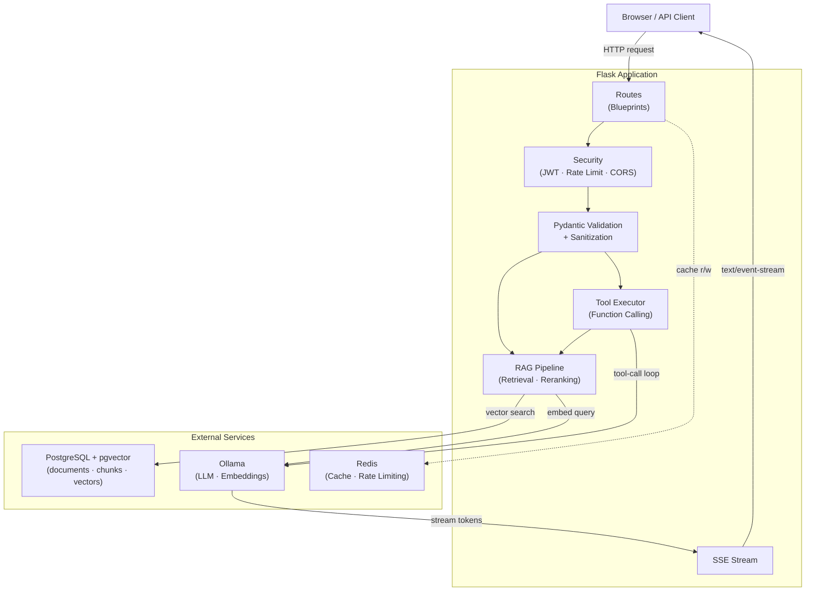

# LocalChat - Professional RAG Application

[](https://www.python.org/downloads/)
[](LICENSE)
[](https://github.com/jwvanderstam/LocalChat/actions/workflows/tests.yml)
[](https://github.com/jwvanderstam/LocalChat/actions/workflows/sonarcloud.yml)
[](https://sonarcloud.io/summary/new_code?id=jwvanderstam_LocalChat)
[](https://sonarcloud.io/summary/new_code?id=jwvanderstam_LocalChat)

A production-ready Retrieval-Augmented Generation (RAG) application built with Flask, Ollama, PostgreSQL (pgvector), and Redis. Features comprehensive document processing, PDF table extraction, intelligent chunking, streaming responses, and accurate context-based answers. Supports documents up to 15 MB with tunable RAG parameters configurable at runtime from the Settings UI.

See the [Architecture](#architecture) and [Project Structure](#project-structure) sections below for a full overview.

---

## Features

### Core Capabilities
- **Document Processing**: PDF, DOCX, TXT, Markdown with advanced table extraction; supports files up to 15 MB
- **RAG Pipeline**: High-quality retrieval — 30-candidate hybrid search, 12-chunk reranking, 0.70 diversity filter
- **Chat Interface**: Real-time streaming responses with document context
- **Enhanced Web Search**: Optional live DuckDuckGo integration for up-to-date answers
- **Persistent Memory**: Conversation history stored in PostgreSQL
- **Vector Search**: Lightning-fast similarity search using pgvector HNSW
- **Table Extraction**: Advanced PDF table detection and preservation
- **Duplicate Prevention**: Smart document fingerprinting
- **Input Validation**: Pydantic models with comprehensive sanitization
- **Caching Layer**: Redis/Memory cache for embeddings and queries
- **Streaming Responses**: Server-Sent Events for real-time feedback
- **Security**: Rate limiting, CORS support, JWT authentication, XSS-safe frontend
- **GPU Acceleration**: Automatic NVIDIA/AMD GPU detection; configurable multi-GPU layer offload via `OLLAMA_NUM_GPU`
- **Observability**: Prometheus metrics endpoint, request timing middleware, detailed health checks, admin dashboard
- **Runtime RAG Tuning**: `TOP_K_RESULTS`, `RERANK_TOP_K`, `DIVERSITY_THRESHOLD`, `SEMANTIC_WEIGHT` adjustable live from Settings UI without restart

### Quality Assurance
- **Comprehensive Tests**: Unit, integration, and comprehensive test suites
- **Type Safety**: Full type hints across codebase
- **Modular Architecture**: Clean separation of concerns
- **CI/CD Ready**: GitHub Actions configuration
- **Error Handling**: Professional exception system with context preservation

### Security
- **XSS Prevention**: DOM-based rendering; `escapeHtml()` wraps all server-controlled values injected into `innerHTML`
- **Path Traversal Prevention**: `sanitize_filename()` + `validate_path()` belt-and-suspenders on every upload
- **AST-Safe Calculator**: `eval()` replaced with a recursive AST evaluator; only arithmetic is permitted
- **Rate Limiting**: Configurable per-endpoint via Flask-Limiter
- **CORS Support**: Configurable allowed origins
- **JWT Authentication**: Token-based auth for admin endpoints
- **Input Sanitization**: Pydantic validation + server-side sanitization on all inputs
- **Supply Chain**: Pinned Docker image SHA256 digest; `litellm>=1.72.6`, `h11>=0.16.0`
- **Container Hardening**: Non-root user (UID 1000), `allowPrivilegeEscalation: false`, `drop: ALL` capabilities in Helm charts
- **Secret Scanning**: No credentials in source; placeholder examples only

### Performance Features
- **Hybrid Search**: Combines semantic similarity with BM25 keyword matching
- **Multi-level Caching**: 
  - Embedding cache (5000 capacity)
  - Query cache (1000 capacity)
  - Configurable TTL
- **Efficient Indexing**: HNSW for fast approximate nearest neighbor search
- **Smart Chunking**: Context-aware with table preservation
- **Reranking**: Multi-signal fusion for improved relevance
- **GPU Acceleration**: Multi-GPU support via `OLLAMA_NUM_GPU`; NVIDIA/AMD auto-detection
- **Request Timing**: `X-Request-Duration` header + Prometheus histogram on every response
- **TTL-Cached Subprocess Calls**: `nvidia-smi`/`rocm-smi` results cached 30 s; Ollama `/api/ps` cached 5 s

---

## Table of Contents

- [Quick Start](#quick-start)
- [Architecture](#architecture)
- [Usage](#usage)
- [Project Structure](#project-structure)
- [Documentation](#documentation)
- [Testing](#testing)
- [Configuration](#configuration)
- [Monitoring & Observability](#monitoring--observability)
- [CI/CD & Code Quality](#cicd--code-quality)
- [Development](#development)
- [Contributing](#contributing)
- [License](#license)

---

## Quick Start

```bash
# 1. Clone repository
git clone https://github.com/jwvanderstam/LocalChat
cd LocalChat

# 2. Install dependencies
pip install -r requirements.txt

# 3. Set up PostgreSQL with pgvector
# See Configuration section below for details

# 4. (Optional) Start Redis for caching
redis-server
# Or use memory cache (default)

# 5. Start Ollama
ollama serve

# 6. Run application
python app.py

# 7. Open browser
# http://localhost:5000
```

---

## Usage

Once running, open your browser at `http://localhost:5000`.

- **Chat tab** — ask questions; toggle RAG Mode to ground answers in uploaded documents, Enhanced to additionally query the web via DuckDuckGo.
- **Documents tab** — upload PDF, DOCX, TXT, or Markdown files and test retrieval.
- **Models tab** — select the active Ollama model.
- **API** — all endpoints are documented in the interactive Swagger UI at `/api/docs/`.

---

## Architecture

### System Components

```
+---------------------------------------------------------------+
|                     LocalChat RAG System                      |
+---------------------------------------------------------------+
|                                                               |
|  +------------+    +------------+    +------------+           |
|  |  Web UI    |--->| Flask API  |--->|  Services  |           |
|  | (Browser)  |--->|  (Routes)  |--->|   Layer    |           |
|  +------------+    +------------+    +------------+           |
|                          |                |                   |
|                          |                |                   |
|  +----------------------------------------------------+      |
|  |              Application Core                      |      |
|  +----------------------------------------------------+      |
|  |                                                    |      |
|  |  +------------+  +------------+  +------------+    |      |
|  |  | RAG Engine |  |   Cache    |  |  Security  |    |      |
|  |  |  - Hybrid  |  | - Redis    |  | - Rate     |    |      |
|  |  |    Search  |  | - Memory   |  |   Limit    |    |      |
|  |  |  - Rerank  |  | - TTL      |  | - CORS     |    |      |
|  |  +------------+  +------------+  +------------+    |      |
|  |                                                    |      |
|  |  +------------+  +------------+  +------------+    |      |
|  |  | Document   |  |   Ollama   |  | Monitoring |    |      |
|  |  | Processor  |  |   Client   |  | - Metrics  |    |      |
|  |  | - Extract  |  | - LLM      |  | - Health   |    |      |
|  |  | - Chunk    |  | - Embed    |  | - Logs     |    |      |
|  |  +------------+  +------------+  +------------+    |      |
|  |                                                    |      |
|  +----------------------------------------------------+      |
|                          |                |                   |
|                          |                |                   |
|  +------------+    +------------+    +------------+           |
|  | PostgreSQL |    |   Ollama   |    |   Redis    |           |
|  | + pgvector |    |  (LLM API) |    | (Optional) |           |
|  | - Documents|    | - Embeddings|   | - Caching  |           |
|  | - Chunks   |    | - Generation|   | - Sessions |           |
|  | - Vectors  |    +------------+    +------------+           |
|  +------------+                                               |
|                                                               |
+---------------------------------------------------------------+
```

### Data Flow

```
Document Upload:
  Upload -> Validate -> Extract Text -> Detect Tables ->
  Smart Chunk -> Generate Embeddings -> Store in DB ->
  Update Cache

RAG Query:
  Query -> Cache Check -> Generate Query Embedding ->
  Hybrid Search (Semantic + BM25) -> Retrieve Chunks ->
  Rerank Results -> Format Context -> LLM Generation ->
  Stream Response -> Cache Result

Cache Strategy:
  - Embedding Cache: 7 days TTL, 5000 capacity
  - Query Cache: 1 hour TTL, 1000 capacity
  - LRU eviction for memory cache
  - Redis fallback to memory cache
```

### Request Flow



### Technology Stack

| Layer | Technology | Purpose |
|-------|-----------|---------|
| **Frontend** | HTML, CSS, JavaScript | Web interface |
| **Backend** | Flask 3.1 | Web framework |
| **Database** | PostgreSQL 15+ | Document storage |
| **Vector DB** | pgvector | Similarity search |
| **Cache** | Redis / Memory | Performance optimization |
| **LLM** | Ollama | Local inference |
| **Embeddings** | nomic-embed-text | Vector generation |
| **GPU** | NVIDIA (nvidia-smi) / AMD (rocm-smi) | Hardware acceleration |
| **Metrics** | Prometheus text format v0.0.4 | Observability |
| **Validation** | Pydantic 2.12 | Input validation |
| **Testing** | pytest | Test framework |

---

## Documentation

All documentation lives in-code with comprehensive docstrings and type hints.

### Additional Docs

| Document | Purpose |
|----------|---------|
| [docs/SCHEMA.md](docs/SCHEMA.md) | Database schema, ER diagram, index rationale |
| [docs/TROUBLESHOOTING.md](docs/TROUBLESHOOTING.md) | Common issues and fixes |
| [docs/OPERATIONS.md](docs/OPERATIONS.md) | Backup, restore, and maintenance procedures |
| [docs/ROADMAP.md](docs/ROADMAP.md) | Evolution roadmap and completion status |
| [CONTRIBUTING.md](CONTRIBUTING.md) | Dev setup, test commands, PR conventions |

### Key Entry Points
- **[`app.py`](app.py)** — Application entry point
- **[`src/app_factory.py`](src/app_factory.py)** — Flask app factory with blueprint registration
- **[`src/monitoring.py`](src/monitoring.py)** — Prometheus metrics, request timing, health checks (`/api/metrics`, `/api/health`)
- **[`src/ollama_client.py`](src/ollama_client.py)** — Ollama LLM/embedding client with GPU detection and TTL caching
- **[`src/routes/admin_routes.py`](src/routes/admin_routes.py)** — Admin dashboard with GPU stats and loaded-model breakdown
- **[`src/rag/web_search.py`](src/rag/web_search.py)** — DuckDuckGo web search provider (Enhanced mode)
- **[`src/security.py`](src/security.py)** — Rate limiting, CORS, JWT authentication
- **[`src/config.py`](src/config.py)** — All configuration (env vars, RAG tuning, GPU settings, cache settings)
- **[`config/.env.example`](config/.env.example)** — Environment variable template

### API Documentation
- Interactive Swagger UI available at `/api/docs/` when the app is running
- Configured in [`src/api_docs.py`](src/api_docs.py)

---

## Project Structure

```
LocalChat/
├── app.py                      # Entry point
├── requirements.txt            # Python dependencies
├── config/
│   └── .env.example            # Environment variable template
├── src/                        # Application source code
│   ├── app_factory.py          # Flask app factory (entry: create_app)
│   ├── config.py               # Configuration (env vars, RAG settings)
│   ├── db/                     # PostgreSQL + pgvector database layer
│   │   ├── __init__.py         # Package: Database class + db singleton
│   │   ├── connection.py       # Connection pool, pgvector adapters, schema
│   │   ├── documents.py        # Document & chunk CRUD + vector search
│   │   └── conversations.py    # Conversation & message persistence
│   ├── exceptions.py           # Custom exception hierarchy
│   ├── models.py               # Pydantic request/response models
│   ├── monitoring.py           # Metrics, health checks, decorators
│   ├── ollama_client.py        # Ollama LLM/embedding client
│   ├── security.py             # Rate limiting, CORS, JWT
│   ├── api_docs.py             # Swagger/OpenAPI configuration
│   ├── types.py                # Type definitions
│   ├── cache/                  # Caching layer
│   │   ├── __init__.py         # Factory + re-exports
│   │   ├── managers.py         # Cache manager (embedding, query)
│   │   └── backends/
│   │       ├── base.py         # CacheStats + CacheBackend ABC
│   │       ├── memory.py       # In-memory LRU cache (OrderedDict)
│   │       ├── redis_cache.py  # Redis-backed distributed cache
│   │       └── database_cache.py # PostgreSQL-backed cache
│   ├── performance/
│   │   └── batch_processor.py  # Batch embedding processor
│   ├── rag/                    # RAG pipeline
│   │   ├── cache.py            # Embedding/query cache
│   │   ├── chunking.py         # Smart text chunking
│   │   ├── loaders.py          # PDF/DOCX/TXT file loaders
│   │   ├── processor.py        # Document ingestion orchestrator
│   │   ├── retrieval.py        # Hybrid search (semantic + BM25)
│   │   ├── scoring.py          # Result reranking & fusion
│   │   └── web_search.py       # DuckDuckGo web search provider
│   ├── routes/                 # API endpoints
│   │   ├── admin_routes.py     # Admin dashboard (/admin, /api/admin/stats)
│   │   ├── api_routes.py       # Chat API (/api/chat)
│   │   ├── document_routes.py  # Document management (/api/documents)
│   │   ├── error_handlers.py   # Global error handlers
│   │   ├── memory_routes.py    # Memory/conversation routes
│   │   ├── model_routes.py     # Ollama model management
│   │   └── web_routes.py       # HTML page routes
│   ├── tools/                  # Tool/function calling
│   │   ├── builtin.py          # Built-in tools
│   │   ├── executor.py         # Tool execution engine
│   │   ├── plugin_loader.py    # Plugin discovery & dynamic loading
│   │   └── registry.py         # Tool registration
│   └── utils/
│       ├── logging_config.py   # Structured logging setup
│       └── sanitization.py     # Input sanitization & validation
├── static/                     # Frontend assets
│   ├── css/
│   │   ├── style.css               # Application styles
│   │   ├── bootstrap.min.css       # Bootstrap 5.3.0 (self-hosted)
│   │   ├── bootstrap-icons.css     # Bootstrap Icons 1.10.0 (self-hosted)
│   │   └── fonts/                  # Bootstrap icon fonts (woff, woff2)
│   └── js/
│       ├── bootstrap.bundle.min.js # Bootstrap 5.3.0 JS (self-hosted)
│       ├── chat.js                 # Chat interface logic
│       └── ingestion.js            # Document upload logic
├── templates/                  # Jinja2 HTML templates
│   ├── admin.html              # Operator dashboard (GPU stats, metrics, cache)
│   ├── base.html
│   ├── chat.html
│   ├── documents.html
│   ├── models.html
│   └── overview.html
├── tests/                      # Test suite
│   ├── conftest.py             # Shared fixtures
│   ├── integration/            # Integration tests
│   ├── unit/                   # Unit tests
│   └── utils/                  # Test helpers & mocks
plugins/                        # Drop-in tool plugins (auto-loaded at startup)
    ├── README.md               # Plugin authoring guide
    └── example_plugin.py       # Annotated starter template
```

---

## Testing

### Running Tests

```bash
# Run all tests
pytest

# Run with coverage
pytest --cov=src --cov-report=html

# Run specific category
pytest tests/unit/
pytest tests/integration/

# Run specific test file
pytest tests/unit/test_rag.py

# Run with verbose output
pytest -v

# Run tests in parallel (if pytest-xdist installed)
pytest -n auto
```

### Test Coverage

```bash
# Generate coverage report
pytest --cov=src --cov-report=html

# View report
open htmlcov/index.html

# Or view in terminal
pytest --cov=src --cov-report=term
```

### Current Test Stats

- **Unit Tests**: `tests/unit/` — 48 test modules covering all core components
- **Integration Tests**: `tests/integration/` — 4 modules covering all API route blueprints
- **Total**: 1191 passing tests (9 integration failures require a live PostgreSQL instance)

---

## Configuration

### Environment Variables

Create a `.env` file in the root directory (copy from `config/.env.example`):

```bash
# Database Configuration
export PG_HOST=localhost
export PG_PORT=5432
export PG_USER=postgres
export PG_PASSWORD=your_password
export PG_DB=rag_db

# Ollama Configuration
export OLLAMA_BASE_URL=http://localhost:11434
export OLLAMA_DEFAULT_MODEL=llama3.2
export OLLAMA_EMBEDDING_MODEL=nomic-embed-text:latest
# GPU layer offload: -1 = all layers on GPU (default), 0 = CPU only
export OLLAMA_NUM_GPU=-1

# Redis Configuration (Optional)
export REDIS_ENABLED=False          # Set to True to enable Redis
export REDIS_HOST=localhost
export REDIS_PORT=6379
export REDIS_DB=0
export REDIS_PASSWORD=                # Leave empty if no password

# Flask Configuration
export SECRET_KEY=your_secret_key_here
export JWT_SECRET_KEY=your_jwt_secret_here
export ADMIN_PASSWORD=your_admin_password_here  # Required for /api/auth/login
export FLASK_ENV=production
export DEBUG=False

# Security Configuration
export RATELIMIT_ENABLED=True
export RATELIMIT_CHAT=10 per minute
export RATELIMIT_UPLOAD=5 per hour
export CORS_ENABLED=False
export CORS_ORIGINS=http://localhost:3000

# Observability
# Leave METRICS_TOKEN empty to allow unauthenticated Prometheus scraping
# (acceptable on a private network). Set a strong token in production.
export METRICS_TOKEN=
```

### Cache Configuration

LocalChat supports two caching backends:

#### Memory Cache (Default)
- **Pros**: No external dependencies, fast, simple setup
- **Cons**: Lost on restart, limited capacity, single-process only
- **Best for**: Development, testing, light loads

```bash
# Enable memory cache (default)
export REDIS_ENABLED=False
```

#### Redis Cache (Production)
- **Pros**: Persistent, distributed, large capacity
- **Cons**: Requires Redis server
- **Best for**: Production, high load, multi-process deployments

```bash
# Enable Redis cache
export REDIS_ENABLED=True
export REDIS_HOST=localhost
export REDIS_PORT=6379
export REDIS_PASSWORD=your_password  # Optional

# Start Redis
redis-server

# Or with Docker
docker run -d -p 6379:6379 redis:alpine
```

### RAG Configuration

Core RAG parameters can be tuned **at runtime** in the Settings → RAG Parameters tab, or set via environment variables. Changes from the UI take effect immediately for all subsequent queries — no restart required.

| Parameter | Default | Env var | Range | Description |
|---|---|---|---|---|
| `TOP_K_RESULTS` | 30 | `TOP_K_RESULTS` | 10–50 | Initial retrieval candidate pool |
| `RERANK_TOP_K` | 12 | `RERANK_TOP_K` | 4–20 | Chunks passed to LLM after reranking |
| `DIVERSITY_THRESHOLD` | 0.70 | *(UI only)* | 0.50–0.90 | Jaccard threshold for near-duplicate filtering |
| `SEMANTIC_WEIGHT` | 0.70 | `SEMANTIC_WEIGHT` | 0.30–0.90 | Semantic vs. BM25 blend in hybrid search |

Parameters that require re-ingesting documents (chunk size, overlap) are set via environment variables only:

```bash
# Chunking — changing these requires re-uploading all documents
CHUNK_SIZE=1200          # Characters per chunk
CHUNK_OVERLAP=150        # Overlap between chunks (12.5%)

# Retrieval
TOP_K_RESULTS=30         # Initial candidates
RERANK_TOP_K=12          # Chunks sent to LLM

# Context window
OLLAMA_NUM_CTX=8192      # Token context window sent to Ollama
                         # MAX_CONTEXT_LENGTH defaults to OLLAMA_NUM_CTX × 3 chars

# Ingestion timeouts (supports files up to 15 MB)
OLLAMA_EMBED_TIMEOUT=600 # Seconds — worst-case 15 MB TXT ~280 s
GUNICORN_TIMEOUT=600     # Must be >= OLLAMA_EMBED_TIMEOUT
```

### Document Capacity

LocalChat supports documents up to **15 MB** on CPU-only hardware:

| Format | Chunks @ 15 MB | DB size | Ingest time |
|--------|---------------|---------|-------------|
| TXT    | ~14,000       | ~160 MB | ~280 s      |
| DOCX   | ~8,000        | ~95 MB  | ~160 s      |
| PDF    | ~3,500        | ~40 MB  | ~70 s       |

Each chunk stores a 768-dim float32 embedding vector (~3 KB). The HNSW index scales to millions of chunks with sub-second query latency.

### Performance Tuning

#### Database Optimization
```python
# Connection Pool
DB_POOL_MIN_CONN = 2
DB_POOL_MAX_CONN = 10

# HNSW Index Parameters
# ef_search is computed dynamically as max(TOP_K_RESULTS * 2, 40)
DB_INDEX_TYPE = 'hnsw'        # Use HNSW for fast ANN search
```

#### Processing Configuration
```python
# Parallel Processing
MAX_WORKERS = 8               # Concurrent threads
BATCH_SIZE = 512             # Embeddings batch size (512 chunks per call)

# Table Extraction
KEEP_TABLES_INTACT = True     # Don't split tables across chunks
MIN_TABLE_ROWS = 3           # Minimum rows to detect as table
```

See [`src/config.py`](src/config.py) for all configuration options.

---

## Monitoring & Observability

### Prometheus Metrics

The application exposes a Prometheus-compatible scrape endpoint:

```
GET /api/metrics        — Prometheus text format v0.0.4
GET /api/metrics.json   — JSON metrics snapshot (used by admin dashboard)
GET /api/health         — Detailed component health check
```

Sample output from `/api/metrics`:
```
# TYPE http_requests_total counter
http_requests_total{method="GET",endpoint="health_check",status="200"} 42
# TYPE http_request_duration_seconds histogram
http_request_duration_seconds_count 42
http_request_duration_seconds_sum 1.234
http_request_duration_seconds_bucket{le="0.1"} 38
http_request_duration_seconds_bucket{le="+Inf"} 42
# TYPE app_uptime_seconds gauge
app_uptime_seconds 3600.5
```

Every response also carries an `X-Request-Duration` header (e.g. `0.042s`).

### Securing the Scrape Endpoint

Set `METRICS_TOKEN` in `.env` to require a Bearer token:

```bash
export METRICS_TOKEN=your_strong_token_here
```

Prometheus scrape config:
```yaml
scrape_configs:
  - job_name: localchat
    static_configs:
      - targets: ['localhost:5000']
    bearer_token: your_strong_token_here
```

Leave `METRICS_TOKEN` empty for unauthenticated access (safe on a private network).

### Health Check

```
GET /api/health
```

Returns `200 healthy`, `200 degraded` (Ollama down), or `503 unhealthy` (database down):

```json
{
  "status": "healthy",
  "timestamp": "2026-03-19T10:00:00.000000",
  "checks": {
    "database": { "status": "up", "healthy": true },
    "ollama":   { "status": "up", "healthy": true },
    "cache":    { "status": "up", "healthy": true, "stats": { "hits": 120, "misses": 5 } }
  }
}
```

### Admin Dashboard

Navigate to `/admin` (JWT required in production; open in demo mode).

The dashboard surfaces:
- **GPU Hardware** — per-physical-GPU cards: VRAM usage bar, utilisation %, temperature (refreshed every 30 s)
- **Loaded Models** — per-model VRAM breakdown with GPU offload % (refreshed every 5 s)
- **Cache Stats** — embedding cache and query cache hit rates
- **System Info** — app version, active model, uptime, request count

### GPU Acceleration

LocalChat automatically detects available GPUs:

| Vendor | Tool | Detection |
|--------|------|-----------|
| NVIDIA | `nvidia-smi` | Auto-detected if on `PATH` |
| AMD    | `rocm-smi`   | Auto-detected if on `PATH` |

Control GPU layer offload in `.env`:

```bash
# -1 = all transformer layers on GPU (recommended when VRAM is sufficient)
#  0 = CPU-only inference
#  N = offload N layers to GPU
export OLLAMA_NUM_GPU=-1
```

The value is forwarded in `options.num_gpu` on every `/api/chat` and `/api/embed` request,
so Ollama distributes work across all detected GPUs automatically when multiple GPUs are present.

---

## Development

### Setting Up Development Environment

```bash
# Install dependencies
pip install -r requirements.txt

# Install pre-commit hooks
pre-commit install

# Run code formatters
black src/ tests/
isort src/ tests/

# Run linters
pylint src/
mypy src/
```

### Code Quality Standards

- **Type Hints**: 100% (required)
- **Docstrings**: Google-style (required)
- **Test Coverage**: >=80% for new code
- **Linting**: Pass pylint, mypy, black
- **Static Analysis**: SonarCloud Quality Gate must pass
- **Documentation**: Update relevant docs

---

## CI/CD & Code Quality

Two GitHub Actions workflows run on every push and pull request to `main`, plus automated dependency updates via Dependabot:

| Workflow / Config | File | Purpose |
|---|---|---|
| **Tests** | `.github/workflows/tests.yml` | Runs all unit tests on Python 3.11 |
| **SonarCloud** | `.github/workflows/sonarcloud.yml` | Runs unit tests with coverage, then uploads results to SonarCloud |
| **CodeQL** | `.github/workflows/codeql.yml` | Python `security-extended` static analysis on push/PR to main + weekly Monday scan |
| **Dependabot** | `.github/dependabot.yml` | Weekly PRs for pip and GitHub Actions version bumps; auto-assigned to `jwvanderstam` with labels `dependencies` / `ci` |

### SonarCloud

Static analysis and coverage tracking are handled by [SonarCloud](https://sonarcloud.io/summary/new_code?id=jwvanderstam_LocalChat).

- **Project key**: `jwvanderstam_LocalChat`
- **Organisation**: `jwvanderstam`
- **Configuration**: [`sonar-project.properties`](sonar-project.properties)
- **Coverage source**: `coverage.xml` produced by `pytest --cov=src --cov-report=xml`

Vendored third-party assets (`static/css/bootstrap*.css`, `static/js/bootstrap*.js`, `static/css/fonts/`) are excluded from analysis so they don't skew metrics.

To run the same coverage report locally that the SonarCloud workflow uses:

```bash
pytest tests/unit/ -v --tb=short --cov=src --cov-report=xml --cov-report=term-missing
```

The `coverage.xml` file is produced in the project root and is picked up automatically by the `sonarcloud-github-action`.

### Development Workflow

1. **Create feature branch**
   ```bash
   git checkout -b feature/your-feature
   ```

2. **Write code and tests**
   ```bash
   # Add tests first (TDD)
   pytest tests/unit/test_your_feature.py
   ```

3. **Check code quality**
   ```bash
   black src/ tests/
   pylint src/
   pytest --cov
   ```

4. **Commit and push**
   ```bash
   git add .
   git commit -m "feat: your feature"
   git push origin feature/your-feature
   ```

5. **Create pull request**

---

## Changelog

See [GitHub Releases](https://github.com/jwvanderstam/LocalChat/releases) for version history.

---

## Contributing

We welcome contributions!

### Quick Contribution Guide

1. Fork the repository
2. Create a feature branch
3. Make your changes
4. Add tests
5. Update documentation
6. Submit a pull request

### Code of Conduct

- Be respectful and inclusive
- Follow coding standards
- Write clear commit messages
- Add tests for new features
- Update documentation

---


## Troubleshooting

### Common Issues

**Issue**: RAG not retrieving documents
```bash
# Check if documents are uploaded
curl http://localhost:5000/api/documents/stats

# Test retrieval
curl -X POST http://localhost:5000/api/documents/test \
  -H "Content-Type: application/json" \
  -d '{"query": "test"}'
```

**Issue**: Ollama connection failed
```bash
# Check Ollama is running
curl http://localhost:11434/api/tags

# Restart Ollama
ollama serve
```

**Issue**: Database connection error
```bash
# Check PostgreSQL is running
pg_isready

# Check pgvector extension
psql rag_db -c "SELECT * FROM pg_extension WHERE extname='vector';"
```

See [`src/config.py`](src/config.py) for database and connection pool settings.

---

## License

This project is licensed under the MIT License - see the [LICENSE](LICENSE) file for details.

---

## Acknowledgments

- **Ollama** for local LLM inference
- **pgvector** for vector similarity search
- **Flask** for web framework
- **Pydantic** for data validation
- **pytest** for testing framework

---

## Support

- **Source Code**: [`src/`](src/)
- **Configuration**: [`src/config.py`](src/config.py)
- **Issues**: [GitHub Issues](https://github.com/jwvanderstam/LocalChat/issues)

---

## Roadmap

- [x] Docker deployment & Kubernetes configs
- [x] Monitoring dashboard
- [x] Advanced RAG techniques (query expansion, multi-hop)
- [ ] Multi-language support
- [x] Plugin system
- [x] Admin dashboard

---

## Star History

If you find this project useful, please consider giving it a star!

---

**Made with care by the LocalChat Team**

*Professional RAG application for document-based question answering*
