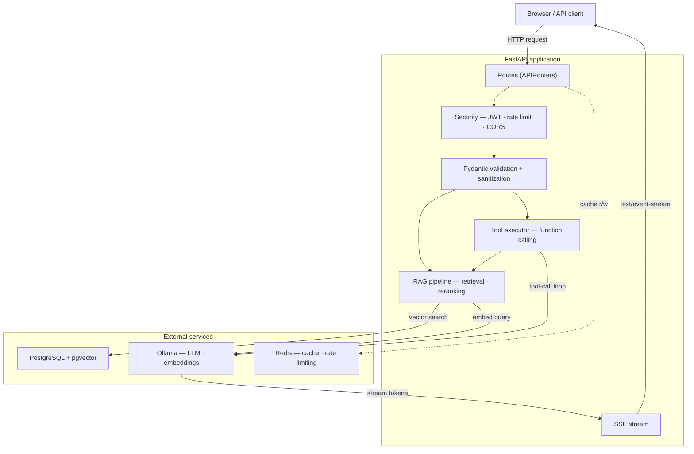

# LocalChat

[](https://www.python.org/downloads/)
[](LICENSE)
[](https://github.com/jwvanderstam/LocalChat/actions/workflows/tests.yml)
[](https://sonarcloud.io/summary/new_code?id=jwvanderstam_LocalChat)
[](https://sonarcloud.io/summary/new_code?id=jwvanderstam_LocalChat)

Chat with your own documents, using a language model that runs on your own hardware.
Upload PDF, DOCX, TXT or Markdown; LocalChat chunks and embeds them into PostgreSQL with
pgvector, and answers questions from what it retrieves. Nothing leaves the machine unless
you enable web search or a cloud fallback.

Built with FastAPI, Ollama, PostgreSQL + pgvector and Redis. Hybrid semantic and lexical
retrieval, a cross-encoder reranker, tool calling, streaming answers, per-workspace
document isolation, and RAG parameters tunable at runtime.

> **"Production-patterned", not "production-ready".** LocalChat is a single-node,
> self-hosted appliance for a small team of up to 25 users — see [ADR-1](docs/ADR.md). It
> follows production patterns throughout and is being hardened against the exit criteria
> in the [production plan](docs/PRODUCTION_PLAN.md). Until those pass, the stronger claim
> would overstate it. Multi-tenant SaaS and horizontal scaling are out of scope: running
> more than one replica breaks cache coherence and rate limiting silently.

---

## Quick start

```bash
git clone https://github.com/jwvanderstam/LocalChat
cd LocalChat
cp .env.example .env          # edit database and Ollama settings if they are not local
docker compose up -d          # PostgreSQL, Redis, Ollama and the app
```

Open <http://localhost:5000>. You will be asked to sign in.

**Getting the first password.** If you set `ADMIN_PASSWORD` in `.env`, use that with the
username `admin`. If you left it empty, an admin account is seeded on first boot with a
generated password, logged once:

```bash
docker compose logs app | grep ADMIN_PASSWORD
```

Then pull a model and select it under **Models** — without an active model, chat returns
`400 No active model set`:

```bash
docker compose exec ollama ollama pull llama3.2:latest
```

Upload a document under **Documents**, and ask about it under **Chat**.

<details>
<summary>Running the app outside Docker</summary>

```bash
pip install -r requirements.txt
cp .env.example .env
docker compose up -d db redis ollama   # backing services only
python app.py
```
</details>

## What it does

**Retrieval.** Hybrid search combines an independent semantic arm (pgvector) and a lexical
arm (PostgreSQL tsvector), blended by weight, then reranked by a cross-encoder. GraphRAG
expands queries one hop through entity co-occurrences. Chunking preserves table structure,
and PDF tables are extracted rather than flattened.

**Answers.** Streaming responses over SSE, with tool calling, optional live web search, and
long-term memory extracted from earlier conversations. Model routing picks a model class
per query; a cloud model can be configured as fallback.

**Isolation and access.** Documents, conversations and memories are scoped to a workspace.
Access is role-based, both globally (admin or user) and per workspace (viewer, editor,
owner). Workspace API keys give a bot or workflow scoped, revocable access to exactly one
workspace.

**Integrity.** Records other data refers to are never hard-deleted. A delete sets
`deleted_at`; purging is a separate, admin-only operation with preconditions. See the
Clark-Wilson section in [CLAUDE.md](CLAUDE.md).

**Sources.** Document connectors for local folders, S3, SharePoint, OneDrive, Google Drive,
Confluence and webhooks. Plugins extend the application without modifying it, under an
[inward-only dependency contract](.claude/rules/plugins.md).

## How it works


```mermaid
flowchart TD
    Browser["Browser / API client"]

    subgraph FastAPI["FastAPI application"]
        Routes["Routes (APIRouters)"]
        Auth["Security — JWT · rate limit · CORS"]
        Pydantic["Pydantic validation + sanitization"]
        RAG["RAG pipeline — retrieval · reranking"]
        Tools["Tool executor — function calling"]
        SSE["SSE stream"]
    end

    subgraph Services["External services"]
        PG["PostgreSQL + pgvector"]
        Ollama["Ollama — LLM · embeddings"]
        Redis["Redis — cache · rate limiting"]
    end

    Browser -->|HTTP request| Routes
    Routes --> Auth
    Auth --> Pydantic
    Pydantic --> RAG
    RAG -->|vector search| PG
    RAG -->|embed query| Ollama
    Pydantic --> Tools
    Tools -->|tool-call loop| Ollama
    Tools --> RAG
    Ollama -->|stream tokens| SSE
    SSE -->|text/event-stream| Browser
    Routes -.->|cache r/w| Redis
```

A request is parsed and validated at the boundary, authorised against the workspace, then
handed to a service. Routes hold no business logic and no SQL. Blocking work — retrieval,
embedding, database writes — runs in a threadpool so one slow query cannot stall other
requests.

| Layer | Technology |
|---|---|
| Web framework | FastAPI + Uvicorn |
| Database | PostgreSQL 16 + pgvector (psycopg3 pool) |
| LLM | Ollama, local; LiteLLM cloud fallback |
| Embeddings | nomic-embed-text |
| Cache | Redis, with an in-memory fallback |
| Auth | python-jose (JWT), slowapi (rate limiting) |
| Validation | Pydantic 2 |
| Migrations | Alembic |
| Tests | pytest + pytest-asyncio |

Entry point is `app.py` → `create_app()` in `src/app_fastapi.py`. Every module is listed in
the [module index](.claude/rules/file-map.md).

## Documentation

Full index: **[docs/README.md](docs/README.md)** — organised by
[Diátaxis](https://diataxis.fr/), so what you need depends on what you are doing.

| I want to… | Go to |
|---|---|
| Deploy this properly | [Deployment](docs/DEPLOYMENT.md), [Operations](docs/OPERATIONS.md) |
| Connect a bot or workflow | [Workspace API keys](docs/WORKSPACE_API_KEYS.md), [Discord via n8n](docs/n8n-discord-setup.md) |
| Look up a setting | [Configuration](docs/CONFIGURATION.md), [RAG settings](docs/SETTINGS.md) |
| Understand a decision | [ADRs](docs/ADR.md), [Lessons learned](docs/LESSONS_LEARNED.md) |
| Fix something broken | [Troubleshooting](docs/TROUBLESHOOTING.md) |
| Contribute code | [CLAUDE.md](CLAUDE.md) and [.claude/rules/](.claude/rules/) |

The API is documented live at `/api/docs/` (Swagger UI), and the same documentation is
browsable inside the application under **Docs**.

## Development

```bash
ruff check src/ tests/                       # lint
mypy src --ignore-missing-imports            # types
bandit -r src/ -ll -q -c pyproject.toml      # security
pytest -m "not (slow or ollama or db)"       # fast suite, no external services
```

All four must be clean before a commit; CI enforces the same set. Merging to `main`
requires `unit-tests`, `integration-tests` and `repo-hygiene` to pass, and is a human
decision — auto-merge is off deliberately.

**Current state:** 2,693 tests collected; the fast suite runs 2,579 of them in about 11
minutes at 79.7% coverage. Integration tests need PostgreSQL; some also need Ollama.

Coding standards live in [.claude/rules/](.claude/rules/): [architecture](.claude/rules/architecture.md),
[Python](.claude/rules/python.md), [testing](.claude/rules/testing.md),
[plugins](.claude/rules/plugins.md).

## Security

Report vulnerabilities per [SECURITY.md](SECURITY.md). Route-by-route permissions are
documented in [PERMISSIONS.md](docs/PERMISSIONS.md).

## License

MIT — see [LICENSE](LICENSE).
