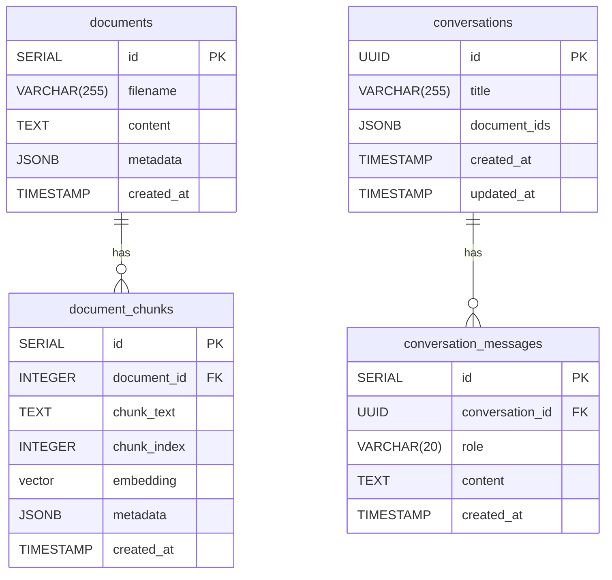

# Database Schema

PostgreSQL 15+ with the [pgvector](https://github.com/pgvector/pgvector) extension.

---

## Entity-Relationship Diagram



---

## Tables

### `documents`

Stores the original documents ingested into the system.

| Column | Type | Notes |
|--------|------|-------|
| `id` | `SERIAL` | Primary key |
| `filename` | `VARCHAR(255)` | Sanitised original filename |
| `content` | `TEXT` | Full extracted text (may be NULL for image-only docs) |
| `metadata` | `JSONB` | Arbitrary document-level metadata (e.g. file size, mime type) |
| `created_at` | `TIMESTAMP` | Ingestion timestamp (UTC) |

### `document_chunks`

Each document is split into overlapping text chunks.  Embeddings live here.

| Column | Type | Notes |
|--------|------|-------|
| `id` | `SERIAL` | Primary key |
| `document_id` | `INTEGER` | FK → `documents.id` (CASCADE DELETE) |
| `chunk_text` | `TEXT` | Raw chunk content |
| `chunk_index` | `INTEGER` | 0-based position within the document |
| `embedding` | `vector(768)` | nomic-embed-text embedding; NULL until generated |
| `metadata` | `JSONB` | Chunk-level metadata: `page_number`, `section_title`, `has_table` |
| `created_at` | `TIMESTAMP` | Chunking timestamp (UTC) |

### `conversations`

One row per chat session.

| Column | Type | Notes |
|--------|------|-------|
| `id` | `UUID` | Primary key (client-generated) |
| `title` | `VARCHAR(255)` | Auto-generated or user-set title |
| `document_ids` | `JSONB` | Array of filenames to restrict RAG retrieval to (default `[]` = all documents) |
| `created_at` | `TIMESTAMP` | Session start (UTC) |
| `updated_at` | `TIMESTAMP` | Last message timestamp (UTC) |

### `conversation_messages`

Individual turns within a conversation.

| Column | Type | Notes |
|--------|------|-------|
| `id` | `SERIAL` | Primary key |
| `conversation_id` | `UUID` | FK → `conversations.id` (CASCADE DELETE) |
| `role` | `VARCHAR(20)` | `"user"` or `"assistant"` |
| `content` | `TEXT` | Message text |
| `created_at` | `TIMESTAMP` | Message timestamp (UTC) |

---

## Indexes

| Index | Table | Columns | Type | Purpose |
|-------|-------|---------|------|---------|
| `document_chunks_embedding_hnsw_idx` | `document_chunks` | `embedding vector_cosine_ops` | **HNSW** | Fast approximate nearest-neighbour search |
| `document_chunks_document_id_idx` | `document_chunks` | `document_id` | B-tree | Fast chunk lookup by document |
| `document_chunks_chunk_index_idx` | `document_chunks` | `(document_id, chunk_index)` | B-tree | Ordered chunk retrieval |
| `conversation_messages_conv_id_idx` | `conversation_messages` | `(conversation_id, created_at)` | B-tree | Ordered message history per conversation |

### HNSW parameters

```sql
CREATE INDEX document_chunks_embedding_hnsw_idx
ON document_chunks USING hnsw (embedding vector_cosine_ops)
WITH (m = 16, ef_construction = 64);
```

- **`m = 16`** — number of bi-directional links per node; higher → better recall, larger index.
- **`ef_construction = 64`** — build-time candidate list size; higher → slower build, better recall.
- **`ef_search = 100`** — set at query time (`SET hnsw.ef_search = 100`) to balance speed vs. recall.
- **Distance:** cosine similarity (`vector_cosine_ops`); matches nomic-embed-text normalised output.

---

## Cascade Behaviour

- Deleting a **document** automatically deletes all its **chunks** (`ON DELETE CASCADE`).
- Deleting a **conversation** automatically deletes all its **messages** (`ON DELETE CASCADE`).

---

## Notes

- The `embedding` column uses the `pgvector` custom type (`vector(768)`).  The extension must be installed: `CREATE EXTENSION IF NOT EXISTS vector;`.
- Embedding dimension is fixed at **768** (nomic-embed-text v1.5).  Changing the model requires a migration to drop and recreate the `embedding` column and its HNSW index.
- All timestamps are stored without timezone.  The application writes UTC; no timezone conversion is applied.
