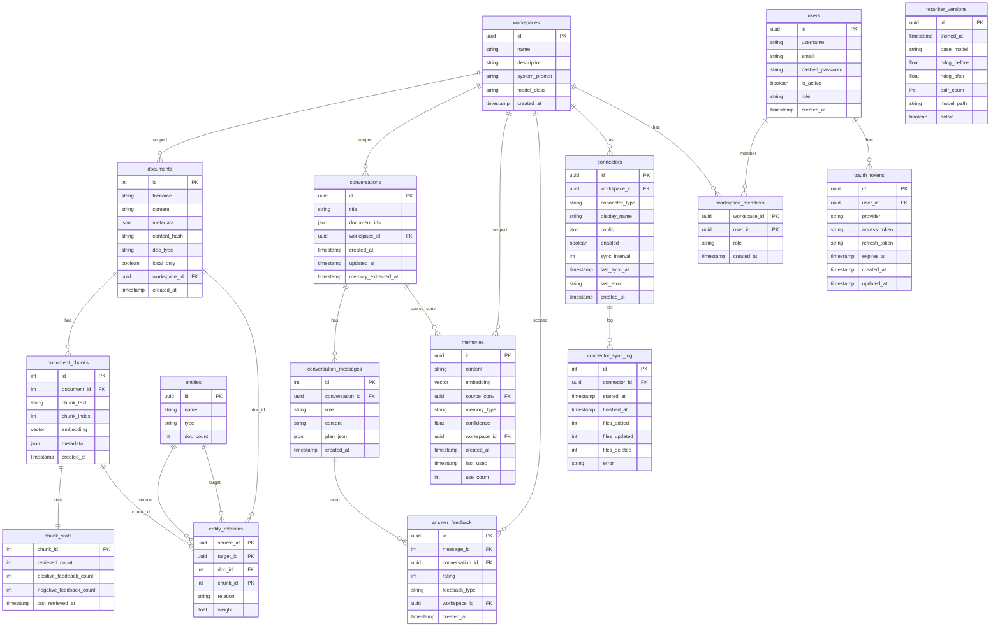

# Database Schema

PostgreSQL 16+ with the [pgvector](https://github.com/pgvector/pgvector) extension.

---

## Entity-Relationship Diagram



---

## Tables

### `documents`

Stores the original documents ingested into the system.

| Column | Type | Notes |
|--------|------|-------|
| `id` | `SERIAL` | Primary key |
| `filename` | `VARCHAR(255)` | Sanitised original filename |
| `content` | `TEXT` | Full extracted text (may be NULL for image-only docs) |
| `metadata` | `JSONB` | Document-level metadata (file size, mime type, etc.) |
| `content_hash` | `VARCHAR(64)` | SHA-256 of file content; used for deduplication |
| `doc_type` | `VARCHAR(20)` | Detected document type (e.g. `pdf`, `docx`) |
| `chunker_version` | `VARCHAR(50)` | Chunker version used at ingest time |
| `local_only` | `BOOLEAN` | `true` = not synced from a connector |
| `workspace_id` | `UUID` | FK → `workspaces.id` (SET NULL on delete) |
| `created_at` | `TIMESTAMP` | Ingestion timestamp (UTC) |

### `document_chunks`

Each document is split into overlapping text chunks. Embeddings live here.

| Column | Type | Notes |
|--------|------|-------|
| `id` | `SERIAL` | Primary key |
| `document_id` | `INTEGER` | FK → `documents.id` (CASCADE DELETE) |
| `chunk_text` | `TEXT` | Raw chunk content |
| `chunk_index` | `INTEGER` | 0-based position within the document |
| `embedding` | `vector(768)` | nomic-embed-text embedding; NULL until generated |
| `metadata` | `JSONB` | Chunk-level metadata: `page_number`, `section_title`, `has_table` |
| `created_at` | `TIMESTAMP` | Chunking timestamp (UTC) |

### `chunk_stats`

Running retrieval and feedback counters per chunk. One row per chunk (1-to-1 with `document_chunks`).

| Column | Type | Notes |
|--------|------|-------|
| `chunk_id` | `INTEGER` | PK + FK → `document_chunks.id` (CASCADE DELETE) |
| `retrieved_count` | `INTEGER` | Number of times included in retrieval results |
| `positive_feedback_count` | `INTEGER` | Thumbs-up feedback count |
| `negative_feedback_count` | `INTEGER` | Thumbs-down feedback count |
| `last_retrieved_at` | `TIMESTAMPTZ` | Most recent retrieval timestamp |

### `entities`

Named entities extracted by GraphRAG from ingested documents.

| Column | Type | Notes |
|--------|------|-------|
| `id` | `UUID` | Primary key |
| `name` | `TEXT` | Entity surface form (e.g. `"PostgreSQL"`) |
| `type` | `VARCHAR(50)` | Entity class (e.g. `"ORG"`, `"PERSON"`) |
| `doc_count` | `INTEGER` | Number of documents containing this entity |

`UNIQUE(name, type)` — each entity surface+type combination is stored once.

### `entity_relations`

Co-occurrence relationships between entities, anchored to specific chunks.

| Column | Type | Notes |
|--------|------|-------|
| `source_id` | `UUID` | FK → `entities.id` (CASCADE DELETE) |
| `target_id` | `UUID` | FK → `entities.id` (CASCADE DELETE) |
| `doc_id` | `INTEGER` | FK → `documents.id` (CASCADE DELETE) |
| `chunk_id` | `INTEGER` | FK → `document_chunks.id` (CASCADE DELETE) |
| `relation` | `VARCHAR(50)` | Relation type; default `"mentioned_with"` |
| `weight` | `FLOAT` | Co-occurrence strength; default `1.0` |

Primary key is `(source_id, target_id, chunk_id)`.

### `conversations`

One row per chat session.

| Column | Type | Notes |
|--------|------|-------|
| `id` | `UUID` | Primary key (client-generated) |
| `title` | `VARCHAR(255)` | Auto-generated or user-set title |
| `document_ids` | `JSONB` | Array of filenames to restrict RAG retrieval to (default `[]` = all documents) |
| `workspace_id` | `UUID` | FK → `workspaces.id` (SET NULL on delete) |
| `created_at` | `TIMESTAMP` | Session start (UTC) |
| `updated_at` | `TIMESTAMP` | Last message timestamp (UTC) |
| `memory_extracted_at` | `TIMESTAMP` | When long-term memory was last extracted for this session |

### `conversation_messages`

Individual turns within a conversation.

| Column | Type | Notes |
|--------|------|-------|
| `id` | `SERIAL` | Primary key |
| `conversation_id` | `UUID` | FK → `conversations.id` (CASCADE DELETE) |
| `role` | `VARCHAR(20)` | `"user"` or `"assistant"` |
| `content` | `TEXT` | Message text |
| `plan_json` | `JSONB` | Query-planner plan attached to the message (nullable) |
| `created_at` | `TIMESTAMP` | Message timestamp (UTC) |

### `memories`

Long-term facts extracted from conversations for persistent context.

| Column | Type | Notes |
|--------|------|-------|
| `id` | `UUID` | Primary key |
| `content` | `TEXT` | Extracted fact or summary |
| `embedding` | `vector(768)` | Embedding for similarity retrieval |
| `source_conv` | `UUID` | FK → `conversations.id` (SET NULL on delete) |
| `memory_type` | `VARCHAR(20)` | `"fact"` or other classification |
| `confidence` | `FLOAT` | Extraction confidence score |
| `workspace_id` | `UUID` | FK → `workspaces.id` (SET NULL on delete) |
| `created_at` | `TIMESTAMP` | Extraction timestamp |
| `last_used` | `TIMESTAMP` | Last time this memory was surfaced |
| `use_count` | `INTEGER` | Number of times surfaced |

### `workspaces`

Logical containers scoping documents, conversations, and memories.

| Column | Type | Notes |
|--------|------|-------|
| `id` | `UUID` | Primary key |
| `name` | `TEXT` | Display name |
| `description` | `TEXT` | Optional description |
| `system_prompt` | `TEXT` | Workspace-level system prompt override |
| `model_class` | `TEXT` | Default model class for this workspace |
| `created_at` | `TIMESTAMPTZ` | Creation timestamp |

A `Default` workspace is auto-created on first startup.

### `users`

Application user accounts.

| Column | Type | Notes |
|--------|------|-------|
| `id` | `UUID` | Primary key |
| `username` | `TEXT` | Unique login name |
| `email` | `TEXT` | Optional unique email address |
| `hashed_password` | `TEXT` | Werkzeug PBKDF2 hash |
| `is_active` | `BOOLEAN` | `false` = account disabled |
| `role` | `TEXT` | Global role: `"admin"` or `"user"` |
| `created_at` | `TIMESTAMPTZ` | Account creation timestamp |

The initial admin user is seeded from `ADMIN_USERNAME` / `ADMIN_PASSWORD` env vars on first startup.

### `workspace_members`

Many-to-many join between users and workspaces with a per-membership role.

| Column | Type | Notes |
|--------|------|-------|
| `workspace_id` | `UUID` | PK + FK → `workspaces.id` (CASCADE DELETE) |
| `user_id` | `UUID` | PK + FK → `users.id` (CASCADE DELETE) |
| `role` | `TEXT` | `"owner"`, `"editor"`, or `"viewer"` |
| `created_at` | `TIMESTAMPTZ` | Membership grant timestamp |

Role hierarchy: `owner > editor > viewer`. Endpoint guards enforce the minimum required role.

### `answer_feedback`

User thumbs-up / thumbs-down ratings on assistant responses.

| Column | Type | Notes |
|--------|------|-------|
| `id` | `UUID` | Primary key |
| `message_id` | `INTEGER` | FK → `conversation_messages.id` (SET NULL on delete) |
| `conversation_id` | `UUID` | FK → `conversations.id` (SET NULL on delete) |
| `rating` | `SMALLINT` | `1` = positive, `-1` = negative |
| `feedback_type` | `TEXT` | Default `"answer_quality"` |
| `correct_doc_ids` | `TEXT[]` | IDs of documents the user indicated were relevant |
| `workspace_id` | `UUID` | FK → `workspaces.id` (SET NULL on delete) |
| `created_at` | `TIMESTAMPTZ` | Feedback timestamp |

### `connectors`

Configured live-sync connectors (local folder, S3, SharePoint, OneDrive, webhook, etc.).

| Column | Type | Notes |
|--------|------|-------|
| `id` | `UUID` | Primary key |
| `workspace_id` | `UUID` | FK → `workspaces.id` (CASCADE DELETE) |
| `connector_type` | `TEXT` | Registered type key, e.g. `"local_folder"`, `"sharepoint"` |
| `display_name` | `TEXT` | Human-readable label |
| `config` | `JSONB` | Connector-specific configuration |
| `enabled` | `BOOLEAN` | `false` = skip on sync passes |
| `sync_interval` | `INT` | Polling interval in seconds (default 900) |
| `last_sync_at` | `TIMESTAMPTZ` | Timestamp of last successful sync |
| `last_error` | `TEXT` | Last error message, if any |
| `created_at` | `TIMESTAMPTZ` | Connector creation timestamp |

### `connector_sync_log`

Per-run audit log for connector sync operations.

| Column | Type | Notes |
|--------|------|-------|
| `id` | `BIGSERIAL` | Primary key |
| `connector_id` | `UUID` | FK → `connectors.id` (CASCADE DELETE) |
| `started_at` | `TIMESTAMPTZ` | Run start time |
| `finished_at` | `TIMESTAMPTZ` | Run end time (NULL if in progress) |
| `files_added` | `INT` | Documents ingested in this run |
| `files_updated` | `INT` | Documents re-ingested in this run |
| `files_deleted` | `INT` | Documents removed in this run |
| `error` | `TEXT` | Error message if the run failed |

### `reranker_versions`

Version history for fine-tuned cross-encoder reranker models.

| Column | Type | Notes |
|--------|------|-------|
| `id` | `UUID` | Primary key |
| `trained_at` | `TIMESTAMPTZ` | Training completion timestamp |
| `base_model` | `TEXT` | Base model used (e.g. `cross-encoder/ms-marco-MiniLM-L-6-v2`) |
| `ndcg_before` | `FLOAT` | NDCG score before fine-tuning |
| `ndcg_after` | `FLOAT` | NDCG score after fine-tuning |
| `pair_count` | `INT` | Number of training pairs used |
| `model_path` | `TEXT` | Filesystem path to the saved model |
| `active` | `BOOLEAN` | `true` = currently loaded by the reranker |

Only one row may have `active = true` at a time. `promote_model` / `rollback_model` toggle this flag.

### `oauth_tokens`

Encrypted OAuth access and refresh tokens for cloud connector providers.

| Column | Type | Notes |
|--------|------|-------|
| `id` | `UUID` | Primary key |
| `user_id` | `UUID` | FK → `users.id` (CASCADE DELETE) |
| `provider` | `TEXT` | Provider name, e.g. `"microsoft"` |
| `access_token` | `TEXT` | Fernet-encrypted access token |
| `refresh_token` | `TEXT` | Fernet-encrypted refresh token (nullable) |
| `expires_at` | `TIMESTAMPTZ` | Access token expiry time |
| `scopes` | `TEXT[]` | Granted OAuth scopes |
| `created_at` | `TIMESTAMPTZ` | First token storage timestamp |
| `updated_at` | `TIMESTAMPTZ` | Last refresh timestamp |

`UNIQUE(user_id, provider)` — one token set per user per provider. Tokens are encrypted at rest using Fernet with `TOKEN_ENCRYPTION_KEY`.

---

## Indexes

| Index | Table | Columns | Type | Purpose |
|-------|-------|---------|------|---------|
| `document_chunks_embedding_hnsw_idx` | `document_chunks` | `embedding vector_cosine_ops` | HNSW | Approximate nearest-neighbour search |
| `document_chunks_document_id_idx` | `document_chunks` | `document_id` | B-tree | Chunk lookup by document |
| `document_chunks_chunk_index_idx` | `document_chunks` | `(document_id, chunk_index)` | B-tree | Ordered chunk retrieval |
| `conversation_messages_conv_id_idx` | `conversation_messages` | `(conversation_id, created_at)` | B-tree | Ordered message history |
| `memories_embedding_hnsw_idx` | `memories` | `embedding vector_cosine_ops` | HNSW | Memory similarity retrieval |
| `entity_relations_source_idx` | `entity_relations` | `source_id` | B-tree | Outgoing relation lookup |
| `entity_relations_doc_idx` | `entity_relations` | `doc_id` | B-tree | Relations by document |
| `documents_workspace_idx` | `documents` | `workspace_id` | B-tree | Documents by workspace |
| `conversations_workspace_idx` | `conversations` | `workspace_id` | B-tree | Conversations by workspace |
| `connectors_workspace_idx` | `connectors` | `workspace_id` | B-tree | Connectors by workspace |
| `users_username_idx` | `users` | `username` | B-tree | Username lookup at login |
| `idx_workspace_members_user` | `workspace_members` | `user_id` | B-tree | Workspaces per user |
| `answer_feedback_created_idx` | `answer_feedback` | `created_at` | B-tree | Feedback time-range queries |
| `answer_feedback_message_idx` | `answer_feedback` | `message_id` | B-tree | Feedback by message |

### HNSW parameters

```sql
CREATE INDEX ... USING hnsw (embedding vector_cosine_ops)
WITH (m = 16, ef_construction = 64);
```

- **`m = 16`** — bi-directional links per node; higher → better recall, larger index.
- **`ef_construction = 64`** — build-time candidate list; higher → slower build, better recall.
- **`ef_search = 100`** — set per-session (`SET hnsw.ef_search = 100`) to balance speed vs. recall.
- **Distance:** cosine similarity (`vector_cosine_ops`); matches nomic-embed-text normalised output.

---

## Cascade Behaviour

| Delete | Effect |
|--------|--------|
| `documents` row | Cascades to `document_chunks`, `entity_relations` (via doc_id and chunk_id) |
| `document_chunks` row | Cascades to `chunk_stats`, `entity_relations` (via chunk_id) |
| `entities` row | Cascades to `entity_relations` |
| `conversations` row | Cascades to `conversation_messages`; sets `memories.source_conv` to NULL |
| `workspaces` row | Cascades to `workspace_members`, `connectors`, `connector_sync_log`; sets FK columns on `documents`, `conversations`, `memories`, `answer_feedback` to NULL |
| `users` row | Cascades to `workspace_members`, `oauth_tokens` |
| `connectors` row | Cascades to `connector_sync_log` |

---

## Notes

- The `embedding` column uses the `pgvector` custom type (`vector(768)`). The extension must be installed: `CREATE EXTENSION IF NOT EXISTS vector;`.
- Embedding dimension is fixed at **768** (nomic-embed-text v1.5). Changing the model requires a migration to drop and recreate the `embedding` column and its HNSW index, followed by re-ingesting all documents.
- Timestamps without timezone (`TIMESTAMP`) are written as UTC by the application. Newer tables use `TIMESTAMPTZ`.
- OAuth tokens are encrypted at rest with `cryptography.fernet`. The `TOKEN_ENCRYPTION_KEY` env var must be a valid Fernet key (base64url-encoded 32-byte key).
